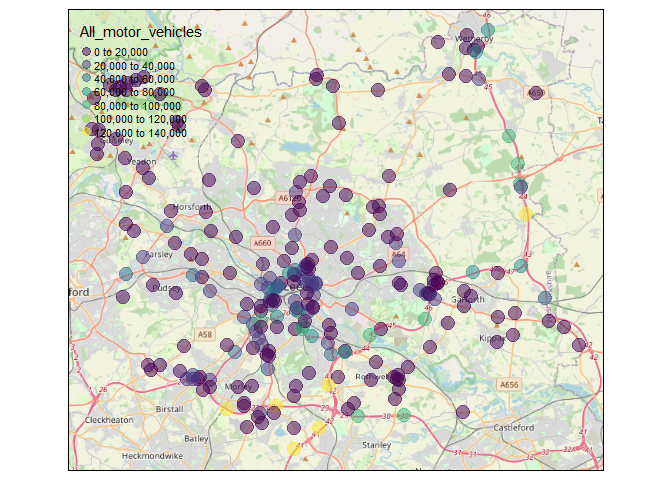

DfT Road Statistics Quick analysis
================
Juan P. Fonseca-Zamora

## Loading the libraries

``` r
library(dplyr)
library(ggplot2)
library(dftTrafficCounts)
library(tmap)
library(sf)
library(tmaptools)
```

## Loading the data

Data is loaded from the DfT repository

``` r
url = "https://storage.googleapis.com/dft-statistics/road-traffic/downloads/data-gov-uk/dft_traffic_counts_aadf.zip"
Roads = dtc_import(u = url)
```

Extracting a subset for the last couple of years

``` r
Recent_data = Roads |> filter(Year>2017)
```

## Quick stats

Number of sites per year by type of site

<!-- -->

How many years of data per site:

``` r
per_year = Recent_data |> 
  group_by(Count_point_id) |>
  summarise(n_years=n()) 
```

<!-- --> \## Last
year’s data

``` r
count_points=Recent_data |>
  filter(Year==2021,Region_id==8) |>
  st_as_sf(coords=c("Longitude","Latitude"),crs="wgs84")

OSM_base = read_osm(count_points, ext=1.1)
tm_shape(OSM_base)+tm_rgb()+
tm_shape(count_points)+tm_dots(col="All_motor_vehicles",alpha=0.5,size = 0.15)
```

<!-- -->
